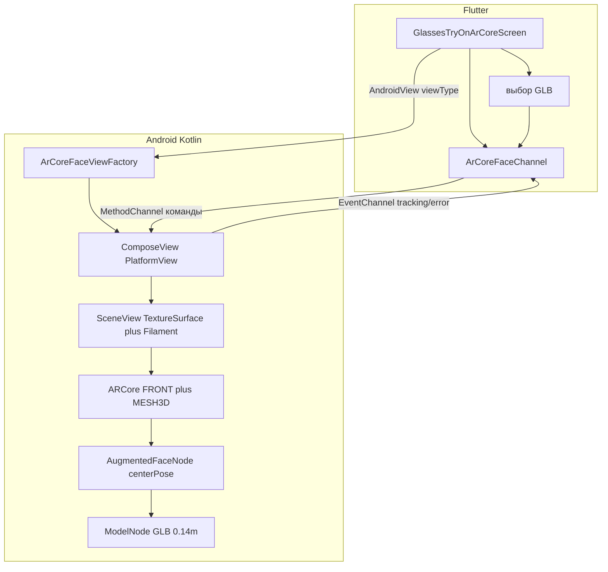

# Новый экран: 3D-примерка через нативный ARCore

## Что уже есть и чем это не является

Сейчас три независимых режима:

- фото 2D PNG — [`lib/screens/glasses_try_on_photo_screen.dart`](lib/screens/glasses_try_on_photo_screen.dart)
- live 2D PNG поверх `camera` — [`lib/screens/glasses_try_on_live_screen.dart`](lib/screens/glasses_try_on_live_screen.dart)
- статичный GLB-оверлей (`flutter_3d_controller` / model-viewer) — [`lib/screens/glasses_try_on_3d_screen.dart`](lib/screens/glasses_try_on_3d_screen.dart) + [`lib/glasses_3d/glasses_3d_overlay.dart`](lib/glasses_3d/glasses_3d_overlay.dart)

Нативный слой пустой: [`MainActivity.kt`](android/app/src/main/kotlin/com/alamat/test_google_mlkit/MainActivity.kt) — только `FlutterActivity`. ARCore в Gradle/манифесте нет. Ассеты уже есть: `assets/sunglasses.glb`, `assets/sunglasses_lenses.glb`.

ARCore **нельзя** смешать с текущим live-потоком: пакет `camera` и ARCore не делят одну камеру. На новом экране ML Kit и `CameraPreview` не используются — трекинг лица делает ARCore.

Готовый Flutter-плагин (`augen`, `arcore_flutter_plugin`, `flutter_sceneview`) **не берём**: нужен собственный контракт channel и полный контроль над face-сессией. Но писать собственную связку «ARCore camera external texture + Filament renderer + glTF loader» тоже нецелесообразно. Для нативного Android-рендера используем Maven-библиотеку **SceneView 4.30.0**: внутри остаются нативные ARCore 1.54.0 и Filament, а Flutter видит только наш `PlatformView` и наши каналы.

## Целевой UX

Новая страница «ARCore примерка»: фронтальная камера, очки «приклеены» к лицу в 3D (поворот головы, расстояние), сверху Flutter-хром (AppBar, статус трекинга, выбор модели). Вход — кнопка с [`GlassesTryOnPhotoScreen`](lib/screens/glasses_try_on_photo_screen.dart) рядом с «3D примерка (GLB)». iOS в этой задаче не делаем.

Нужно **физическое ARCore-сертифицированное Android-устройство с фронтальной камерой и Google Play Services for AR**. Официальный ARCore AVD эмулирует только заднюю камеру; Augmented Faces на эмуляторе проверить нельзя.

## Почему именно Augmented Faces

Это официальный API ARCore для примерки на лицо ([гайд](https://developers.google.com/ar/develop/java/augmented-faces/developer-guide), образец `augmented_faces_java`, текущий SDK 1.54.0):

- сессия: `Session.Feature.FRONT_CAMERA` + явный выбор `frontCameraConfig` + `Config.AugmentedFaceMode.MESH3D`
- на кадр: `session.getAllTrackables(AugmentedFace::class.java)`
- якоря: `centerPose` (за переносицей) и регионы `NOSE_TIP` / `FOREHEAD_LEFT` / `FOREHEAD_RIGHT`

Полную оправу сначала привязываем к `centerPose`: этот pose является системой координат всей головы и стабильнее для широкого аксессуара. `NOSE_TIP` оставляем переключаемым вариантом калибровки, если конкретный GLB подготовлен с origin на переносице. ARCore-anchors здесь не создаём: front-camera Augmented Faces не поддерживает `createAnchor`.

## Связь Flutter ↔ Android

Два канала на каждый экземпляр view + один PlatformView (не «голый» MethodChannel без превью: ARCore должен рисовать камеру и модель в нативной поверхности).

**viewType:** `com.alamat.test_google_mlkit/arcore_face_view`

После `onPlatformViewCreated(viewId)` Flutter создаёт:

**MethodChannel** `com.alamat.test_google_mlkit/arcore_face/method_$viewId`:

- `getState` — последнее состояние availability/session/tracking (защита от потери первого event)
- `setModelAsset` — Flutter asset key, например `assets/sunglasses.glb`
- `setCalibration` — `widthMeters`, `offsetX/Y/Z`, `rotationX/Y/Z`, `anchor=center|nose`
- `retrySession` — повтор после установки ARCore/выдачи permission

**EventChannel** `com.alamat.test_google_mlkit/arcore_face/events_$viewId`:

- `{type: availability, state: checking|installRequested|ready|unsupported}`
- `{type: session, state: starting|running|paused|failed, message?: ...}`
- `{type: tracking, state: searching|tracking|lost}`
- `{type: model, state: loading|ready|failed, message?: ...}`

Каналы создаёт сам `ArCoreFacePlatformView`, поэтому два открытых view не перехватывают команды друг друга. Последнее состояние хранится и возвращается через `getState`, потому что `EventChannel` может подписаться уже после первого native callback.

`creationParams` передают начальный asset и калибровку, чтобы первый кадр не зависел от гонки channel. Flutter передаёт asset key, а Kotlin получает реальный APK-путь через `FlutterInjector.instance().flutterLoader().getLookupKeyForAsset(...)`; копировать GLB во временный файл и подключать `path_provider` не нужно.

Поток face pose **не отправляем во Flutter каждый кадр**: tracking и rendering остаются на native/GL-потоке. Через EventChannel идут только переходы состояния.

## Нативный рендер

Внутри `PlatformView` размещаем `ComposeView`, а в нём `ARSceneView(surfaceType = SurfaceType.TextureSurface)`. Это тот же подход, который использует официальный Flutter bridge SceneView: `TextureSurface` лучше подходит для встраивания и Flutter-оверлеев, чем вложенный `GLSurfaceView`.

Конфигурация SceneView/ARCore:

- `planeRenderer = false`
- `sessionFeatures = setOf(Session.Feature.FRONT_CAMERA)`
- `sessionCameraConfig = ::frontCameraConfig`
- `augmentedFaceMode = MESH3D`, plane/depth/geospatial выключены
- в `onSessionUpdated` берём единственное лицо со `TrackingState.TRACKING`
- `AugmentedFaceNode` обновляет `centerNode`/`regionNodes`; дочерний `ModelNode` рендерит GLB

SceneView нужен именно как **нативный renderer/scene graph**, а не как Flutter-плагин. Это убирает самописный external-OES camera shader, UV rotation, projection synchronization и GLB resource loading — наиболее рискованную часть старого плана.

Жизненный цикл и permission нельзя оставлять на автоматическом поиске Activity через `PlatformView` context: Flutter может передать `MutableContextWrapper`. Factory получает `MainActivity` напрямую и явно передаёт в `ARSceneView` `ActivityARPermissionHandler(activity)` и `activity.lifecycle`. `dispose()` отменяет channels и вызывает `ComposeView.disposeComposition()`, после чего SceneView освобождает ARCore/Filament. Камеру Flutter-плагину на этом экране не открывать.

Для фронтальной ARCore-сессии нельзя рассчитывать на Environmental HDR. Сохраняем PBR-материалы GLB, но добавляем нейтральный фиксированный main/fill light; при слишком тёмной модели отдельно проверяем unlit-вариант, не уничтожая прозрачность линз.

## Калибровка модели (главный риск посадки)

[`assets/sunglasses.glb`](assets/sunglasses.glb) сейчас используется только model-viewer-оверлеем и не проверен в ARCore. В ARCore единица — **метр**; модель должна смотреть по осям SceneView/ARCore, а origin должен быть согласован с выбранным pose.

SceneView `ModelNode(scaleToUnits = 0.14f)` нормализует максимальный габарит примерно к ширине реальной оправы 14 см; дальше настраиваем local offset/rotation. Это надёжнее произвольного коэффициента `0.08–0.15`.

Новые AR-константы храним отдельно от ML Kit. Если GLB требует большой компенсации осей/origin, корректируем исходную модель в Blender и повторно экспортируем — не прячем ошибку ассета в сложных матрицах.

В MVP используем только [`assets/sunglasses.glb`](assets/sunglasses.glb). [`assets/sunglasses_lenses.glb`](assets/sunglasses_lenses.glb) не считаем второй полноценной оправой, пока визуально не проверено, что это самостоятельная модель, а не только линзы.

Для реалистичной примерки вторым проходом добавляем **face-mesh occlusion**: невидимая 468-точечная сетка пишет depth перед очками, чтобы дужки и части оправы не просвечивали через лицо. Это отдельный проверяемый этап после стабильной посадки; для Filament потребуются depth-only material и правильный render priority.

## Изменения по файлам

**Android**

- [`android/settings.gradle.kts`](android/settings.gradle.kts): Compose Compiler plugin той же версии, что Kotlin (`2.2.20`).
- [`android/app/build.gradle.kts`](android/app/build.gradle.kts): `minSdk = 24`, `buildFeatures.compose = true`, Compose BOM и `io.github.sceneview:arsceneview:4.30.0`. Отдельно ARCore/Filament не дублируем: SceneView уже фиксирует совместимые ARCore 1.54.0 и renderer-зависимости.
- [`android/app/src/main/AndroidManifest.xml`](android/app/src/main/AndroidManifest.xml): `CAMERA` уже есть; добавить front camera, `android.hardware.camera.ar` и GLES 3 как **required=false**, `meta-data com.google.ar.core=optional`, чтобы существующие не-AR экраны оставались доступны.
- Kotlin (пакет `com.alamat.test_google_mlkit.arcore`):
  - `ArCoreFaceViewFactory.kt`
  - `ArCoreFacePlatformView.kt` — ComposeView, lifecycle, per-view channels
  - `ArCoreFaceScene.kt` — `ARSceneView`, FRONT+MESH3D, face/model nodes
  - `ArCoreGlassesConfig.kt` — asset, pose, метрическая калибровка
  - при включении occlusion: исходник/скомпилированный Filament depth-only material
- [`MainActivity.kt`](android/app/src/main/kotlin/com/alamat/test_google_mlkit/MainActivity.kt) — перейти с `FlutterActivity` на `FlutterFragmentActivity` (это `ComponentActivity`, нужный `ActivityARPermissionHandler`), зарегистрировать factory и передать ему Activity/lifecycle/binary messenger.

**Flutter**

- `lib/arcore/arcore_face_controller.dart` — per-view MethodChannel/EventChannel и типизированные состояния
- `lib/arcore/arcore_face_view.dart` — `AndroidView`, creation params, fallback «только Android»
- `lib/arcore/arcore_glasses_calibration.dart`
- `lib/screens/glasses_try_on_arcore_screen.dart` — UI состояния, PlatformView, retry, калибровка
- [`lib/screens/glasses_try_on_photo_screen.dart`](lib/screens/glasses_try_on_photo_screen.dart) — кнопка/иконка перехода
- Комментарии на русском, как в остальном `lib/`

Существующие `face_tracking/` и `glasses_3d/` не рефакторим.

## Порядок реализации (чтобы можно было проверять по шагам)

1. Gradle/Compose/SceneView + манифест; собрать APK до написания UI, чтобы сразу проверить совместимость Kotlin/Compose/AGP.
2. Per-view PlatformView + channels; добиться фронтального ARCore preview и честных состояний install/permission/error.
3. Включить MESH3D и проверить `searching → tracking → lost` на физическом устройстве.
4. Загрузить `sunglasses.glb`, привязать к `centerPose`, нормализовать ширину до 0.14 м и откалибровать offset/rotation.
5. Добавить фиксированный свет, корректный lifecycle/dispose и переход с фото-экрана.
6. Добавить depth-only face mesh occlusion и проверить дужки/переносицу при yaw/pitch.
7. `analyze_files`, `flutter build apk --debug`, затем device-тест: 10 входов/выходов, background/resume, permission denied, ARCore отсутствует, портрет, повороты головы.

## Ограничения, которые стоит заложить в UI

- Только Android; на других платформах — заглушка.
- Один пользователь в кадре (ARCore front-camera Augmented Faces возвращает максимум одно отслеживаемое лицо).
- Без ARCore / без Play Services — SnackBar и выход, не краш.
- Не посылаем матрицы лица через channel на 30/60 FPS; иначе channel станет лишней задержкой между tracking и renderer.
- Посадка и occlusion принимаются только по тесту на реальном устройстве; APK/эмулятор не подтверждают качество примерки.
